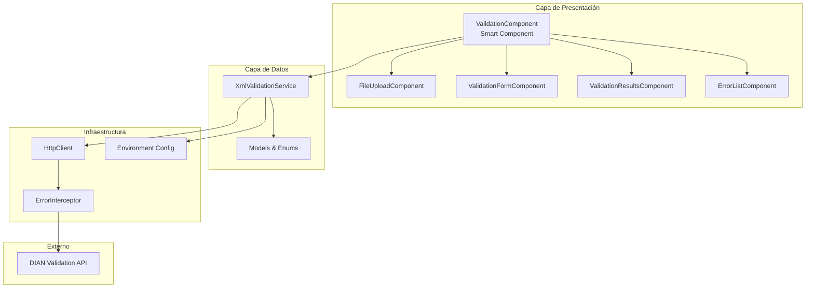

# Propuesta de Arquitectura - DIAN XML Validator

## Análisis de la Arquitectura Actual

### Problemas Identificados

1. **Estructura híbrida inconsistente**: Mezcla de módulos tradicionales (core.module.ts) con standalone components
2. **Carpetas vacías**: Muchas carpetas creadas sin contenido (containers/, guards/, interceptors/, etc.)
3. **Ubicación incorrecta de modelos**: Los modelos del dominio de validación están en `core/` en lugar de `features/validation/`
4. **Falta de configuración de entornos**: No hay environment files configurados
5. **Servicio con hardcoded URL**: La URL del API está hardcodeada en el servicio
6. **Typo en nombre de archivo**: `type-doucument-enum.ts` en lugar de `type-document-enum.ts`

---

## Propuesta de Arquitectura Limpia

### Principios Aplicados

1. **Standalone Components**: Angular moderno sin NgModules
2. **Feature-Based Organization**: Cada feature es auto-contenido
3. **Clean Architecture**: Separación clara de responsabilidades
4. **Smart/Dumb Components**: Contenedores vs presentacionales
5. **State Management Simplificado**: Signals para estado local

---

## Nueva Estructura de Carpetas

```
src/
├── app/
│   ├── core/                          # Singletons de aplicación
│   │   ├── config/
│   │   │   ├── environment.ts         # Configuración por defecto
│   │   │   └── environment.prod.ts    # Configuración producción
│   │   └── interceptors/
│   │       └── error.interceptor.ts   # Manejo global de errores HTTP
│   │
│   ├── features/                      # Features independientes (lazy-loaded)
│   │   └── validation/
│   │       ├── data/                  # Capa de acceso a datos
│   │       │   ├── models/            # Modelos del dominio
│   │       │   │   ├── validation-request.model.ts
│   │       │   │   ├── validation-result.model.ts
│   │       │   │   ├── validation-issue.model.ts
│   │       │   │   └── api-response.model.ts
│   │       │   ├── enums/
│   │       │   │   ├── document-type.enum.ts
│   │       │   │   ├── error-status.enum.ts
│   │       │   │   └── validation-error-type.enum.ts
│   │       │   └── services/
│   │       │       └── xml-validation.service.ts
│   │       │
│   │       ├── ui/                    # Componentes de presentación
│   │       │   ├── file-upload/
│   │       │   │   ├── file-upload.component.ts
│   │       │   │   ├── file-upload.component.html
│   │       │   │   └── file-upload.component.scss
│   │       │   ├── validation-form/
│   │       │   │   ├── validation-form.component.ts
│   │       │   │   ├── validation-form.component.html
│   │       │   │   └── validation-form.component.scss
│   │       │   ├── validation-results/
│   │       │   │   ├── validation-results.component.ts
│   │       │   │   ├── validation-results.component.html
│   │       │   │   └── validation-results.component.scss
│   │       │   └── error-list/
│   │       │       ├── error-list.component.ts
│   │       │       ├── error-list.component.html
│   │       │       └── error-list.component.scss
│   │       │
│   │       ├── validation.component.ts      # Smart component (container)
│   │       ├── validation.component.html
│   │       ├── validation.component.scss
│   │       └── validation.routes.ts         # Rutas del feature
│   │
│   ├── shared/                        # Componentes/utilidades compartidas
│   │   ├── components/
│   │   │   └── header/
│   │   │       ├── header.component.ts
│   │   │       ├── header.component.html
│   │   │       └── header.component.scss
│   │   └── ui/                        # Componentes UI genéricos reutilizables
│   │       └── severity-tag/
│   │           ├── severity-tag.component.ts
│   │           ├── severity-tag.component.html
│   │           └── severity-tag.component.scss
│   │
│   ├── app.config.ts                  # Configuración standalone
│   ├── app.routes.ts                  # Rutas principales
│   ├── app.component.ts               # Componente raíz
│   ├── app.component.html
│   └── app.component.scss
│
├── environments/                      # Configuración de entornos
│   ├── environment.ts
│   └── environment.prod.ts
│
├── styles/                            # Estilos globales
│   ├── _variables.scss
│   ├── _mixins.scss
│   └── main.scss
│
├── index.html
└── main.ts
```

---

## Cambios Detallados

### 1. Eliminaciones

| Ruta | Razón |
|------|-------|
| `src/app/core/core.module.ts` | Innecesario en standalone architecture |
| `src/app/core/models/` | Modelos específicos deben estar en el feature |
| `src/app/core/services/` | Servicios específicos deben estar en el feature |
| `src/app/features/validation/components/` | Estructura innecesariamente anidada |
| `src/app/features/validation/containers/` | Vacío, usar componente raíz del feature |
| `src/app/features/validation/guards/` | Vacío |
| `src/app/features/validation/interceptors/` | Vacío, mover a `core/interceptors/` |
| `src/app/features/validation/models/` | Vacío, mover a `data/models/` |
| `src/app/features/validation/services/` | Vacío, mover a `data/services/` |
| `src/app/features/validation/templates/` | Vacío |
| `src/app/features/validation/validation.module.ts` | Innecesario en standalone |
| `src/app/shared/modules/` | Innecesario en standalone |
| `src/app/shared/pipes/` | Pipe no existe |
| `src/app/config/` | Vacío, usar `environments/` |
| `src/app/tests/` | Mover a `src/tests/` o mantener junto a archivos |

### 2. Nuevas Ubicaciones

| Modelo Actual | Nueva Ubicación |
|---------------|-----------------|
| `core/models/api-response.ts` | `features/validation/data/models/api-response.model.ts` |
| `core/models/validation-issue.model.ts` | `features/validation/data/models/validation-issue.model.ts` |
| `core/models/xml-validation-request.model.ts` | `features/validation/data/models/validation-request.model.ts` |
| `core/models/xml-validation-result.ts` | `features/validation/data/models/validation-result.model.ts` |
| `core/models/enums/status-error-enum.ts` | `features/validation/data/enums/error-status.enum.ts` |
| `core/models/enums/type-doucument-enum.ts` | `features/validation/data/enums/document-type.enum.ts` |
| `core/models/enums/validation-errorType-enum.ts` | `features/validation/data/enums/validation-error-type.enum.ts` |
| `core/services/xml-validation.service.ts` | `features/validation/data/services/xml-validation.service.ts` |

### 3. Nuevos Archivos

| Archivo | Propósito |
|---------|-----------|
| `environments/environment.ts` | Configuración desarrollo (API URL, etc.) |
| `environments/environment.prod.ts` | Configuración producción |
| `core/interceptors/error.interceptor.ts` | Manejo global de errores HTTP |
| `features/validation/validation.routes.ts` | Rutas específicas del feature |
| `features/validation/ui/file-upload/` | Componente de subida de archivos |
| `features/validation/ui/validation-form/` | Formulario de validación |
| `features/validation/ui/validation-results/` | Visualización de resultados |
| `features/validation/ui/error-list/` | Lista de errores agrupada |
| `shared/ui/severity-tag/` | Componente reutilizable de severidad |

---

## Arquitectura de Componentes

### Smart Component (Container)
**`ValidationComponent`**
- Responsabilidad: Orquestar el flujo de validación
- Conoce el servicio y el estado
- No contiene lógica de presentación

### Dumb Components (Presentacionales)

| Componente | Responsabilidad | Inputs | Outputs |
|------------|-----------------|--------|---------|
| `FileUploadComponent` | Subida de archivos XML | `fileName`, `loading` | `fileSelected`, `reset` |
| `ValidationFormComponent` | Formulario tipo doc + clave técnica | `documentType`, `technicalKey`, `disabled` | `documentTypeChange`, `technicalKeyChange`, `validate` |
| `ValidationResultsComponent` | Mostrar resultado global | `maxSeverity`, `isValid`, `errorsCount` | - |
| `ErrorListComponent` | Listar errores agrupados | `errorsByType` | - |
| `SeverityTagComponent` | Tag de color según severidad | `severity` | - |

---

## Diagrama de Flujo de Datos



---

## Beneficios de la Nueva Arquitectura

1. **Separación de Responsabilidades**: Cada capa tiene un propósito claro
2. **Testabilidad**: Componentes dumb son fáciles de testear
3. **Reusabilidad**: Componentes UI pueden usarse en otros features
4. **Mantenibilidad**: Estructura predecible y consistente
5. **Escalabilidad**: Fácil agregar nuevos features siguiendo el patrón
6. **Modern Angular**: Aprovecha standalone components al máximo

---

## Plan de Migración

1. Crear nueva estructura de carpetas
2. Mover modelos a ubicaciones correctas
3. Crear environments
4. Refactorizar servicio para usar environment
5. Crear componentes UI dumb
6. Refactorizar ValidationComponent como smart component
7. Eliminar archivos y carpetas obsoletas
8. Actualizar imports y rutas
9. Verificar funcionamiento
