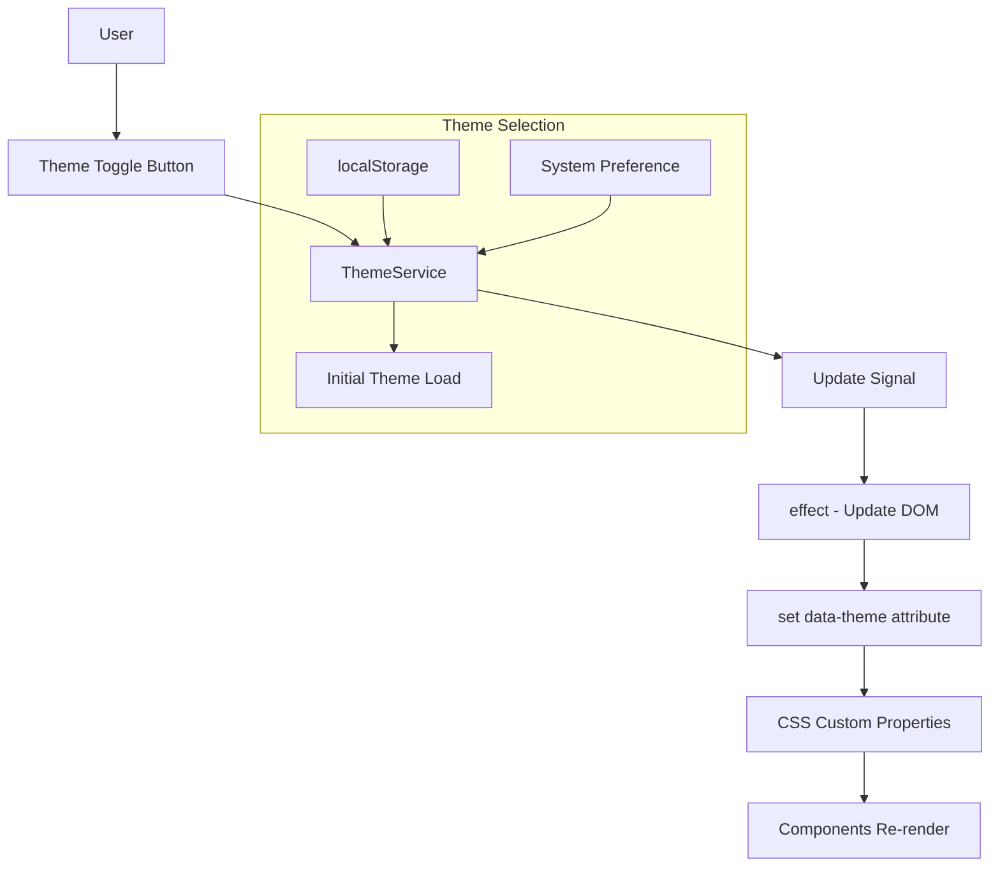

# Dark Theme Implementation Plan

## Executive Summary

The project already has a basic `ThemeService` infrastructure using Angular signals, but lacks the CSS foundation for proper dark theme support. This plan outlines implementing a professional, enterprise-grade dark theme suitable for a business application.

---

## Current State Analysis

### ✅ Existing Infrastructure
- [`ThemeService`](src/app/core/services/theme.service.ts) - Signal-based theme management with localStorage persistence and system preference detection
- `data-theme` attribute already applied to `document.documentElement`

### ❌ Missing Components
1. **No CSS Custom Properties** - All colors are hardcoded
2. **Inconsistent color usage** - Direct hex values throughout components
3. **No theme switching UI** - No toggle button in header
4. **Ant Design overrides needed** - NG-ZORRO components need dark theme customization

---

## Implementation Plan

### Phase 1: Foundation - CSS Custom Properties
**Files to modify:**
- [`src/styles.scss`](src/styles.scss) - Add CSS variables for both themes

```scss
:root {
  /* Light Theme (default) */
  --color-primary: #1890ff;
  --color-primary-dark: #096dd9;
  --color-primary-light: #40a9ff;
  --color-success: #52c41a;
  --color-warning: #faad14;
  --color-error: #ff4d4f;
  --color-info: #1890ff;
  
  /* Backgrounds */
  --bg-primary: #ffffff;
  --bg-secondary: #f0f2f5;
  --bg-tertiary: #fafafa;
  --bg-hover: #f0f7ff;
  
  /* Text colors */
  --text-primary: rgba(0, 0, 0, 0.85);
  --text-secondary: rgba(0, 0, 0, 0.45);
  --text-tertiary: rgba(0, 0, 0, 0.25);
  
  /* Borders */
  --border-color: #f0f0f0;
  --border-color-secondary: #d9d9d9;
  
  /* Component specific */
  --header-bg: linear-gradient(135deg, #1890ff 0%, #096dd9 100%);
  --header-text: #ffffff;
  --card-shadow: 0 4px 12px rgba(0, 0, 0, 0.05);
  
  /* File upload */
  --upload-bg: #fafafa;
  --upload-bg-hover: #f0f7ff;
  --file-info-bg: #e6f7ff;
  --file-info-border: #91d5ff;
  --file-info-text: #0050b3;
}

[data-theme='dark'] {
  /* Primary colors - adjusted for dark mode contrast */
  --color-primary: #177ddc;
  --color-primary-dark: #1366b3;
  --color-primary-light: #3d91e6;
  --color-success: #49aa19;
  --color-warning: #d48806;
  --color-error: #f5222d;
  --color-info: #177ddc;
  
  /* Backgrounds - dark theme palette */
  --bg-primary: #141414;
  --bg-secondary: #1f1f1f;
  --bg-tertiary: #262626;
  --bg-hover: #1f3a5f;
  
  /* Text colors */
  --text-primary: rgba(255, 255, 255, 0.85);
  --text-secondary: rgba(255, 255, 255, 0.45);
  --text-tertiary: rgba(255, 255, 255, 0.25);
  
  /* Borders */
  --border-color: #303030;
  --border-color-secondary: #434343;
  
  /* Component specific */
  --header-bg: linear-gradient(135deg, #177ddc 0%, #1366b3 100%);
  --header-text: #ffffff;
  --card-shadow: 0 4px 12px rgba(0, 0, 0, 0.3);
  
  /* File upload */
  --upload-bg: #1f1f1f;
  --upload-bg-hover: #1f3a5f;
  --file-info-bg: #1f3a5f;
  --file-info-border: #177ddc;
  --file-info-text: #69c0ff;
}
```

### Phase 2: Component Refactoring
**Files to modify:**

1. [`src/app/shared/components/header/header.component.scss`](src/app/shared/components/header/header.component.scss)
   - Replace hardcoded colors with CSS variables
   - Add theme-aware styles

2. [`src/app/features/validation/validation.component.scss`](src/app/features/validation/validation.component.scss)
   - Update card, text, and status colors

3. [`src/app/features/validation/ui/file-upload/file-upload.component.scss`](src/app/features/validation/ui/file-upload/file-upload.component.scss)
   - Update dragger and file info box colors

4. [`src/app/app.scss`](src/app/app.scss)
   - Update layout background and footer colors

### Phase 3: Theme Toggle UI
**Files to modify:**

1. [`src/app/shared/components/header/header.component.html`](src/app/shared/components/header/header.component.html)
   - Add theme toggle button

2. [`src/app/shared/components/header/header.component.ts`](src/app/shared/components/header/header.component.ts)
   - Inject ThemeService and add toggle method

3. [`src/app/shared/components/header/header.component.scss`](src/app/shared/components/header/header.component.scss)
   - Add toggle button styling

### Phase 4: Ant Design Dark Theme Integration
**File to modify:**
- [`src/app/app.config.ts`](src/app/app.config.ts) or main styles

```typescript
import { provideNzI18n } from 'ng-zorro-antd/i18n';
import { registerLocaleData } from '@angular/common';
import es from '@angular/common/locales/es';
import { provideNzDarkTheme } from 'ng-zorro-anted/dark-theme'; // If using ng-zorro-antd dark theme

registerLocaleData(es);
```

---

## Architecture Diagram



---

## Component Color Mapping Reference

| Component | Current Color | CSS Variable |
|-----------|---------------|--------------|
| Header gradient | `#1890ff → #096dd9` | `--header-bg` |
| Header text | `#ffffff` | `--header-text` |
| Card background | `#ffffff` | `--bg-primary` |
| Layout background | `#f0f2f5` | `--bg-secondary` |
| Primary text | `rgba(0,0,0,0.85)` | `--text-primary` |
| Secondary text | `rgba(0,0,0,0.45)` | `--text-secondary` |
| Upload background | `#fafafa` | `--upload-bg` |
| File info box | `#e6f7ff / #91d5ff` | `--file-info-bg / --file-info-border` |
| Success color | `#52c41a` | `--color-success` |
| Error color | `#ff4d4f` | `--color-error` |
| Warning color | `#faad14` | `--color-warning` |

---

## Implementation Steps Summary

1. **Define CSS custom properties** in `src/styles.scss`
2. **Update ThemeService** to emit events for external components
3. **Refactor all component SCSS files** to use CSS variables
4. **Add theme toggle button** to header
5. **Configure NG-ZORRO dark theme** if using Ant Design components
6. **Test all components** in both themes
7. **Verify accessibility** - ensure contrast ratios meet WCAG AA standards

---

## Recommended Dark Theme Color Palette

For a professional business application, the dark theme should use:

| Purpose | Hex Color | CSS Variable |
|---------|-----------|--------------|
| Background (app) | `#141414` | `--bg-primary` |
| Surface (cards) | `#1f1f1f` | `--bg-secondary` |
| Hover state | `#262626` | `--bg-tertiary` |
| Border | `#303030` | `--border-color` |
| Primary | `#177ddc` | `--color-primary` |
| Text primary | `#ffffff` | `--text-primary` |
| Text secondary | `#a6a6a6` | `--text-secondary` |

---

## Next Steps

Would you like me to proceed with implementing this plan? I can switch to Code mode to start implementing the dark theme.

**Suggested approach:**
1. Start with Phase 1 - CSS variables foundation
2. Move to Phase 2 - Component refactoring
3. Add Phase 3 - Theme toggle UI
4. Final Phase 4 - Ant Design integration
